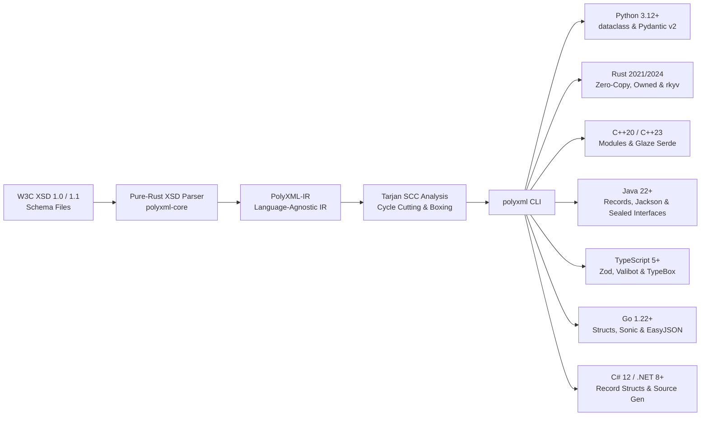
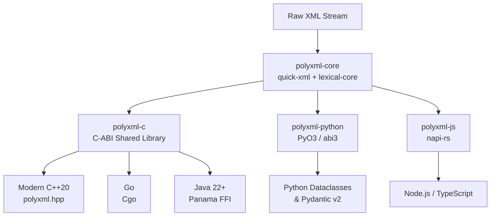

# PolyXML


<p align="center">
  <strong>The "protoc for XML" — Modern XSD-to-Code Generator & High-Performance Streaming Runtime</strong><br>
  <em>Python • Rust • C++20 • Java 22+ • TypeScript • Go • C# 12</em>
</p>

---

## Welcome to PolyXML

**PolyXML turns W3C XML Schemas (`.xsd`) into production-ready, type-safe data models with built-in streaming parsers and serializers.** Written in safe Rust, it compiles schemas once and generates idiomatic, strongly-typed code across 7 modern language runtimes with **zero intermediate DOM allocations**.

While web ecosystems shifted toward JSON and Protocol Buffers, mission-critical infrastructure in **defense & aerospace (UCI)**, **finance (ISO 20022, FIXML)**, and **healthcare (HL7)** remains deeply reliant on XML. PolyXML breaks down language barriers and eliminates legacy performance penalties by providing **one unified, native Rust engine for all tech stacks**.

---

## Supported Ecosystems

=== "Rust"
    Native zero-copy core engine via `polyxml` on [crates.io](https://crates.io/crates/polyxml). Monomorphized, fast streaming parser.

=== "Python"
    Accelerates Python `dataclasses` and **Pydantic v2** models via PyO3 (`abi3-py312`). 10x–24x faster than pure Python XML parsers.

=== "Modern C++20"
    Zero-overhead modern C++20 header-only wrapper (`polyxml.hpp`) with RAII memory management, designed for avionics, robotics, and defense.

=== "Go"
    High-throughput Cgo wrapper providing `polyxml.Deserialize` and `polyxml.Serialize`, replacing Go's slow reflection-based `encoding/xml`.

=== "TypeScript & Node"
    Native Node.js addon compiled via `napi-rs` with full TypeScript definitions (`index.d.ts`), ideal for high-throughput microservices.

=== "Java (Panama FFI)"
    Java 22+ Foreign Function & Memory API (JEP 454) binding directly to off-heap memory with zero JNI boilerplate.

=== "C# 12 / .NET 8+"
    Modern immutable records with primary constructors, standard `System.Xml.Serialization` attributes, polymorphic `xs:choice` hierarchies, and built-in facet validation.

---

## ⚡ Why PolyXML? (Old Way vs. PolyXML Way)

```
Legacy XML Toolchains (JAXB, CodeSynthesis, xsdata, xgen)
❌ Language Silos: Fragmented, unmaintained open-source or costly commercial tools.
❌ Memory Bloat: Intermediate DOM allocations cause 10x-20x memory churn & GC spikes.
❌ Antiquated Code: Sprawling pre-C++11 raw pointers and mutable JavaBeans with getters/setters.
❌ Licensing Traps: GPL v2 dual-licensing or per-seat commercial paywalls (CodeSynthesis, gSOAP).
❌ Security Exposure: Vulnerable by default to XXE file exfiltration (e.g. lxml/xsdata CWE-611).

The PolyXML Way
✅ Unified Rust Tool: Generates idiomatic, type-safe code (like protoc) across 7 languages.
✅ Zero-Allocation Streaming: Direct-to-struct parsing with quick-xml & lexical-core (10x–24x faster).
✅ Dual-Format XML ↔ JSON: Whole-document transcoding (`polyxml transcode`) and dual-annotated models.
✅ Modern Language Idioms: Immutable Java 22+ records, C++20 value types, Python 3.12 PEP 695 dataclasses.
✅ Secure by Design: Pure-Rust streaming parser structurally immune to XXE (CWE-611) & SSRF.
✅ 100% Permissive MIT: Zero commercial licensing fees, zero GPL infection risk.
```

👉 **[Read the Full Architectural Comparison & Head-to-Head Benchmarks →](why-polyxml.md)**

---

## 🛠️ Universal XSD-to-Code Generation

PolyXML includes a full-fledged CLI toolchain (`polyxml`) that transforms W3C XSD 1.0 and 1.1 schemas into strongly-typed data contracts and high-performance codecs across all **7 target ecosystems**:



Tested against the official **W3C XML Schema Test Suite (XSTS)** with **>99.8% schema compilation pass rate** and **>96% round-trip validation pass rate** via [polyxml-w3c-tests](https://github.com/polyxml/polyxml-w3c-tests).

---

## Architecture at a Glance



---

## Benchmarks across all seven languages

Find the [benchmark guide](benchmarks/index.md) for a map of the Rust, Python,
Java, Go, C++, C#, and TypeScript/Wasm suites. It links published studies, run
commands, and a shared XML input that all seven readers can consume. The guide
keeps different serializer and return-value measurements separate, and
distinguishes smoke checks from repeated results.

[Explore benchmarks and results →](benchmarks/index.md)

---

## 🌐 Real-World Industry Showcases

Explore complete, production-ready example repositories showcasing PolyXML in mission-critical industries across **all 7 supported languages**:

| Showcase Repository | Domain & Standards | Key PolyXML Features Highlighted |
| :--- | :--- | :--- |
| **[🛸 Defense & Aerospace](https://github.com/polyxml/polyxml-defense-examples)**<br>`polyxml-defense-examples` | **USAF UCI v2.5** (8.3 MB XML)<br>↔ **Anduril Lattice SDK** (Protobuf/JSON) | • **`backend = "aot"`**: Ahead-of-Time compiled PyO3 native extension with sub-microsecond C2 telemetry parsing (172k+ ops/sec)<br>• **`features = ["rkyv"]`**: Opt-in zero-copy binary serialization in Rust for telemetry & tactical radio links<br>• **`xsd:extension` Inlining**: Base headers (`SecurityInformation`, `MessageHeader`) inlined into derived commands<br>• **Massive Schema Validation**: `polyxml validate` on 8.3 MB, 5,558-type Open-Arsenal schemas<br>• **Standard Library Java 22+**: Zero-dependency immutable records with `java.time.Instant`<br>• **Edge C2 Streaming**: Browser/Node WebAssembly streaming drone swarm telemetry via `parseStream` |
| **[💳 Global Finance & Banking](https://github.com/polyxml/polyxml-finance-examples)**<br>`polyxml-finance-examples` | **ISO 20022 `pacs.008`** (Interbank XML)<br>↔ **FinTech Intents** (FedNow/Stripe JSON) | • **`backend = "jackson"`**: Enterprise Jackson XML/JSON annotations for Spring Boot / Jakarta EE banking<br>• **`backend = "source-gen"`**: C# 12 / .NET 8 `System.Text.Json` source generation for Native AOT<br>• **Strict Facets & Attributes**: XML attributes on simple content (`Ccy="USD"`) & `xs:pattern` regexes (UETR, IBAN)<br>• **Batch Payment Streaming**: WebAssembly `parseStream` consuming high-volume `<Document>` payment batches |
| **[🚍 Smart Cities & Transit](https://github.com/polyxml/polyxml-transit-examples)**<br>`polyxml-transit-examples` | **CEN SIRI v2.0 & NeTEx** (European Norm)<br>↔ **Google GTFS-RT** (Protobuf/JSON) | • **`backend = "sonic"`**: ByteDance's JIT/AVX-accelerated JSON engine for high-throughput Go microservices<br>• **Deeply Nested Collections**: Hierarchical arrays (`VehicleActivity[]`, `MonitoredCall[]`)<br>• **C++20 Concepts & Value Equality**: `XmlModel` concept verification and `operator==` structural comparisons<br>• **Client-Side Map Streaming**: WebAssembly streaming transit vehicle deliveries into passenger maps |

---

## Next Steps

- Check out the [5-Minute Multi-Language Quickstart](quickstart.md) to see PolyXML in action.
- Read about our [XSD-to-Code Generator & CLI Toolchain](guides/compiler.md).
- Choose a [language guide](languages/index.md) for your ecosystem.
- Learn how [Polymorphic Types & `xsi:type` Dispatch](guides/polymorphism.md) work at runtime.
- Read about our [Architecture & Streaming Design](architecture.md).
- Explore [Performance & Benchmarks](benchmarks/index.md).
